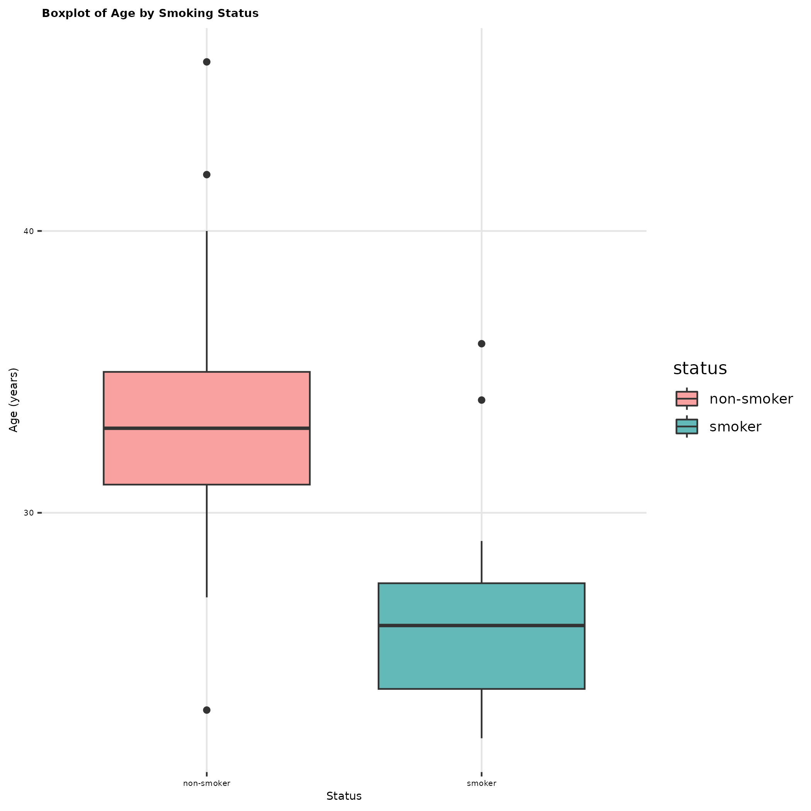

---
title: "Study of Smoking During Pregnancy"
format:
  revealjs:
    embed-resources: true
    theme: sky
    slide-number: c/t
    width: 1600
    height: 900
    mainfont: timesnewroman
    logo: images/r4bds_logo_small.png
    footer: "R for Bio Data Science"
---

<!--# ---------------------------------------------------------------------- -->
<!--# SLIDE ---------------------------------------------------------------- -->
<!--# ---------------------------------------------------------------------- -->

## Titel of slide 2

```{r}
#| echo: false
#| eval: true
#| message: false
#| warning: false

library("tidyverse")
```

- Bulletpoints in the middle

- Bulletpoints

- Bulletpoints


<!--# ---------------------------------------------------------------------- -->
<!--# SLIDE ---------------------------------------------------------------- -->
<!--# ---------------------------------------------------------------------- -->
## Title of 3

{width=70%}


_Figure: An example plot showing results._

<!--# ---------------------------------------------------------------------- -->
<!--# SLIDE ---------------------------------------------------------------- -->
<!--# ---------------------------------------------------------------------- -->
## Title of slide 4 
Sætter billede i midten
{fig-align="center" width=50%}


<!--# ---------------------------------------------------------------------- -->
<!--# SLIDE ---------------------------------------------------------------- -->
<!--# ---------------------------------------------------------------------- -->
## Title of slide 5

:::: {.columns}

::: {.column width="40%"}
Venstre
:::

::: {.column width="60%"}
Højre
:::

::::


<!--# ---------------------------------------------------------------------- -->
<!--# SLIDE ---------------------------------------------------------------- -->
<!--# ---------------------------------------------------------------------- -->
## Title of slide 6

:::: {.columns}

::: {.column width="40%"}
Venstre
:::

::: {.column width="60%"}
Højre
:::

::::


<!--# ---------------------------------------------------------------------- -->
<!--# SLIDE ---------------------------------------------------------------- -->
<!--# ---------------------------------------------------------------------- -->
## Title of slide 7

:::: {.columns}

::: {.column width="40%"}
Venstre
:::

::: {.column width="60%"}
Højre
:::

::::

_Her skrives der i kursiv_


<!--# ---------------------------------------------------------------------- -->
<!--# SLIDE ---------------------------------------------------------------- -->
<!--# ---------------------------------------------------------------------- -->
## Title of slide 8

Skriv her for at skrive i midten øverst på sildet 

:::: {.columns}

::: {.column width="40%"}
Venstre
:::

::: {.column width="60%"}
Højre
:::

::::

<!--# ---------------------------------------------------------------------- -->
<!--# SLIDE ---------------------------------------------------------------- -->
<!--# ---------------------------------------------------------------------- -->
## Title of slide 9 

:::: {.columns}

::: {.column width="40%"}
Venstre
:::

::: {.column width="60%"}
Højre
:::


<!--# ---------------------------------------------------------------------- -->
<!--# SLIDE ---------------------------------------------------------------- -->
<!--# ---------------------------------------------------------------------- -->
## Title of slide 10

:::: {.columns}

::: {.column width="40%"}
Venstre
:::

::: {.column width="60%"}
Højre 
:::

::::
Skriv her for at skrive i midten i bunden 


<!--# ---------------------------------------------------------------------- -->
<!--# SLIDE ---------------------------------------------------------------- -->
<!--# ---------------------------------------------------------------------- -->
## Thanks and bye!


